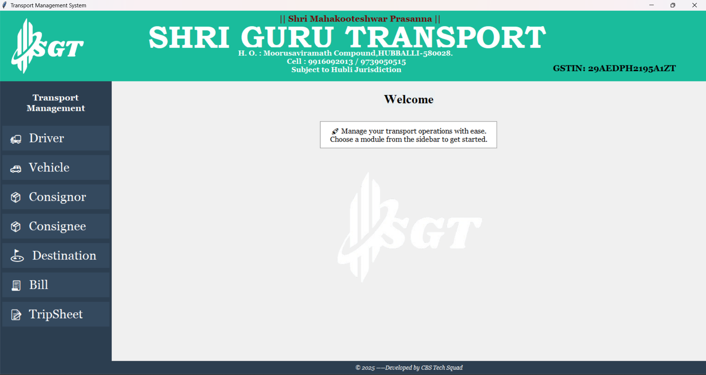
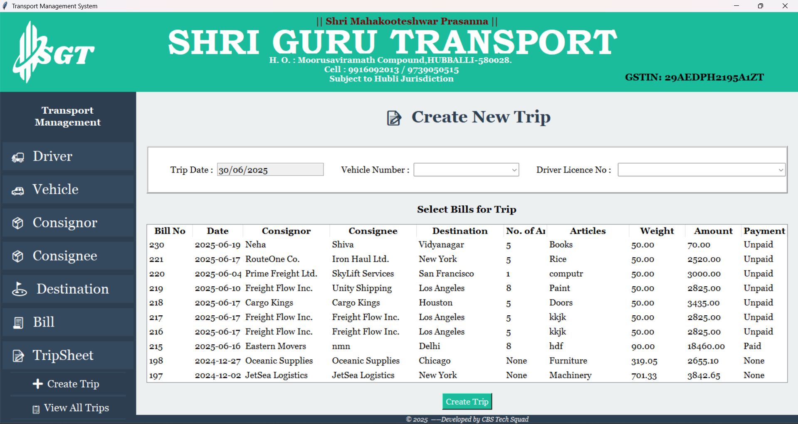
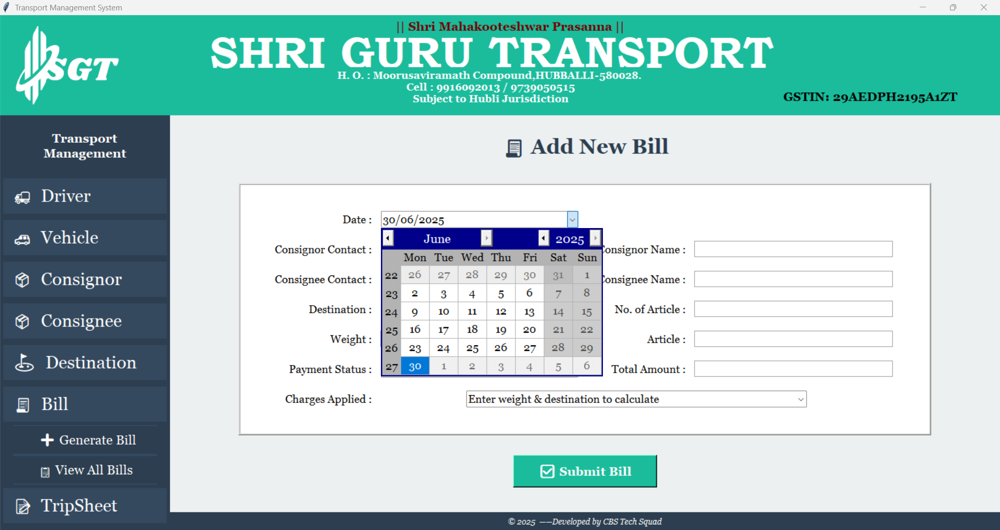

# 🚚 Transport Management System (TMS)

A comprehensive desktop-based transport management software developed using **Python (Tkinter)** for **Shri Guru Transport**. The system is designed to manage consignor, consignee, driver, vehicle, bill, and trip details in an efficient and user-friendly interface.

---

## 🏢 Project Details

- **Project Title:** Transport Management System
- **Developed For:** Shri Guru Transport, Hubballi
- **Developer:** Shivanand Viranna Naganur
- **Platform:** Python 3, Tkinter GUI
- **Database:** SQLite3
- **Academic Year:** 2025

---

## ✨ Key Features

### 🧑‍✈️ Driver Management
- Add, update, and view driver details
- Store license number and contact information

### 🚛 Vehicle Management
- Register vehicles with their unique numbers
- Assign vehicles to trips

### 📦 Consignor & Consignee Management
- Maintain a record of consignors and consignees
- Store addresses and contact details

### 🧭 Destination Module
- Define and manage delivery locations

### 🧾 Bill Generation
- Create new bills for shipments
- Calculate amount based on weight and distance
- Payment status: Paid/Unpaid/None
- View and manage all previous bills

### 📝 TripSheet Management
- Create trips by selecting multiple bills
- Assign vehicle and driver to a trip
- View all created trips
- Status tracking and delivery overview

---

## 🖼️ Screenshots

| Home | Create Trip| Add Bill |
|------|-------------|----------|
|  |  |  |

---

